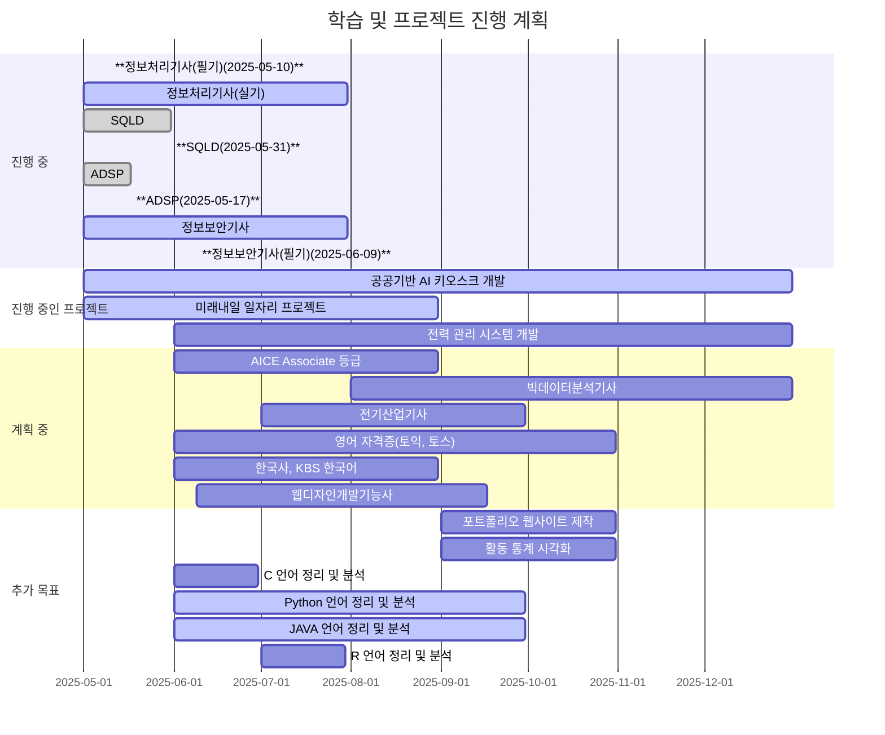

<p align='center'>

      
개발자이자 데이터 분석가를 목표로, 항상 새로운 기술을 배우고 실험하는 것을 좋아합니다.  
현재는 Python, SQL, AI/ML 관련 프로젝트를 진행 중이며, 지속적으로 포트폴리오를 확장하고 있습니다.

저는 코드뿐 아니라, 삶의 다양한 경험을 통해 배우는 것을 중요하게 생각합니다.
단순히 기술을 익히는 것을 넘어, 새로운 환경과 사람을 만나며 얻는 통찰이 저에게 큰 자산이 된다고 느낍니다.
특히 스페인 산티아고 순례길을 걸으며 끈기와 관찰력, 그리고 다양한 시각을 이해하는 태도를 배울 수 있었습니다.
이러한 경험들은 문제를 더 깊이 있게 바라보고, 기술을 사람 중심으로 연결하는 개발자로 성장하는 데 소중한 밑거름이 되고 있습니다.

---

# 💡 관심 있는 분야

- AI/ML: 데이터 분석 및 머신러닝 모델 개발
- 데이터베이스: SQL을 통한 데이터 분석, 모델링 및 성능 최적화

---
# 🧑‍💼 학력·경험
전공을 통해 기초 기술을 쌓는 한편, 국내외 다양한 환경에서 쌓은 경험을 통해 실무 감각과 글로벌 시야를 함께 키웠습니다.

<details>
<summary>펼치기 👇</summary>
      
## 🎓 학력 사항

**숭실대학교 (SoongSil University)**  
정보통신전자공학부 학사  
2009.03 – 2018.02  
- 주요 과목: 디지털 공학, 컴퓨터 구조, 회로이론, 신호 및 시스템, 데이터통신 등

---

## ✈️ 어학연수 경험
      
**Greenriver Community College(IESL)**  
2007.12 ~ 2008.07  

**Highline Community College(ESL)**  
2008.08 ~ 2009.02  
- 집중 영어 프로그램(회화, 작문, 청취) 수강  
- 다양한 국적의 학생들과 프로젝트 수행
- 기초 전공과목 수강 -

---

## 💼 경력 사항
  
**성우산업 주식회사**  
- 수처리 전문기업  
- 회계 및 재무 관련 문서 정리, 장부 관리  
- 비용·수익 분석 및 보고서 작성
  
**(주)하림**  
- FS(단체급식) 영업 및 사업장 관리
- 식자재 물류 및 휴게소 입찰 등 
- 온라인 유통(쿠팡, SSG, 티몬, 농협 등) 영업 및 관리

**(개인)주식회사 정수**  
- 신재생에너지(태양광) 관련 사업
- 태양광 발전소 운영 지원  
- 시공·발주 협의 보조, 현장 점검 및 관련 문서 작성
  
</details>

---

# 💻 기술과 프로젝트
직접 다뤄본 기술과, 그것을 실제로 활용할 프로젝트 중심으로 구성했습니다.

<details>
<summary>펼치기 👇</summary>

## ⚙️ 기술 스택
- 사용하고 숙달 중인 언어와 도구들을 정리했습니다. 현재도 지속적으로 확장 중 입니다.

      
### 🛠️ 주요 언어


-              

### 🛠️ 개발환경

- 운영체제: 🪟 Windows 11  
- 개발도구: 💻 VS Code, IntelliJ, PyCharm  
- 빌드/배포:  
- 가상화: 🐳 Docker
- 클라우드:

## 💻 진행 중인 프로젝트
- 데이터와 AI 기술을 활용해 현실 문제를 해결하는 프로젝트들을 진행하고 있습니다.

1. **한이음 공모전 - 공공기반 AI 키오스크 (25년 중)**  
   - AI agent 기반 공공기관 목적용 키오스크 개발

2. **미래내일 일자리(25년 중)**

3. **개인 프로젝트 - 인공지능 기반 전력 관리 시스템 (25년 중)**  
   - 인공지능 기술을 활용한 전력망 최적화 시스템 개발 목표

</details>

---

# 📘 자격 및 학습

풀스택 개발자를 목표로 자격증 취득과 학습을 진행하고 있습니다.
단기적으로는 데이터 분석, 프로그래밍, 보안 등 실무에 직접 활용 가능한 기술을 강화하고, 장기적으로는 AI 및 빅데이터 분야의 전문성을 확대하는 것을 목표로 하고 있습니다.

<details>
<summary>펼치기 👇</summary>

## 📜 보유 자격증
- 학습의 깊이와 넓이를 확장하며 실무 중심의 자격증을 꾸준히 준비 중입니다.
    
### 📌 보유
- 네트워크 관리사 2급
- 한국사 1급
- KBS 한국어 3+급

### 📌 진행 중
- 정보처리기사 (5–7월 중)
- SQLD (5월 중)
- ADSP (5월 중)
- 정보보안기사 (5–7월 중)

### 📌 계획 중
- AICE 자격 Associate 등급
- 웹디자인개발기능사 (6월 ~ 9월 중)
- 빅데이터분석기사 (8 – 12월 중)
- 전기산업기사 (7 – 9월 중)
- 영어 자격증 (토익, 토스), 한국사, KBS 한국어 *(재취득 예정)*
 
</details>

---

# 🔧 이 Repository 의 구조
- 이 Repository 의 구조입니다.
      
```
skwjdgh/
├── portfolio/
│   ├── web/
│   └── visualization/
├── projects/
│   ├── ai-kiosk/
│   ├── future-job/
│   └── power-management/
├── study/
│   ├── Front/
│   │   ├── html-css/
│   ├── Back/
│   │   ├── python/
│   │   ├── java/
│   │   ├── c/
│   │   └── sql/
│   └── External/
│       ├── seminar/
│       └── tools/
└── programmers-ex/
```

📂 주요 저장소 (Main Repositories
- [🗂️ 포트폴리오](https://github.com/skwjdgh/Portfolio)<br>
- [🚧 프로젝트](https://github.com/skwjdgh/Project)<br>
- [🎨 Front-End](https://github.com/skwjdgh/Front)<br>
- [🖥️ Back-End](https://github.com/skwjdgh/Back)<br>
- [📦 기타 리소스](https://github.com/skwjdgh/External)<br>

📎 기타 자료 (Additional / Reference)
   - [🧠 세미나](https://github.com/skwjdgh/related-with-AI-semi-)<br>
   - [💻 코딩 연습 문제](https://github.com/skwjdgh/Programmers-ex)<br>
   - [📝 파이썬 과제 모음](https://github.com/skwjdgh/Python101_homework)<br>
   
---

# ✏️ 중단기 목표 및 일정

학습부터 프로젝트까지, 진행 중인 내용과 계획 중인 항목을 구분해 정리했습니다.



## ✏️ 추가목표

- 중단기 목표를 수립하고, 이를 기반으로 기술 학습과 프로젝트 일정을 체계적으로 관리하고 있습니다.
      
### 🌐 포트폴리오 및 시각화
- (9–10월 예정) 포트폴리오 웹사이트 제작 및 배포
- 활동 통계 시각화

### 🧠 학습 내용 재구성 및 정리
1. **Python (6–9월)**: 미흡 코드 재설계 및 삭제, 일자별 → 주제별 폴더 정리  
2. **C 언어 (6월 중)**: 주제별 학습 정리 + C++, C# 차이 분석  
3. **SQL (6월 중)**: MySQL/MariaDB 정리, 명령어별 용도 정리, DB설계 예제 추가 (볼링, 마트)  
4. **HTML/CSS (6–10월)**: 반응형 웹 기준으로 스타일 숙달  
5. **Java (6–9월)**: 수업 중
    
### 📚 개인 공부 및 실습
1. **(8월)**: tkinter, Flask, pandas, NumPy, Matplotlib, seaborn  
2. **(8월)**: R 언어 개인 공부  
3. **(6월)**: LangChain, Ollama, LLaMA 내용 정리 (세미나 연계)  
4. **(12월까지)**: 프로그래머스 문제풀이 → GitHub에 보기 좋게 정리

---

<p align="center">
  
  
</p>

<p align='center'>
      
