```mermaid
gantt
  title 학습 및 프로젝트 진행 계획
  dateFormat  YYYY-MM-DD

  section 진행 중
  **정보처리기사(필기)(2025-05-10)**       :done, 2025-05-10, 2025-05-10
  정보처리기사(실기)                       :active, 2025-05-01, 2025-07-31
  SQLD                                    :active, 2025-05-01, 2025-05-31
  **SQLD(2025-05-31)**                    :active, 2025-05-31, 2025-05-31
  ADSP                                    :active, 2025-05-01, 2025-05-17
  **ADSP(2025-05-17)**                    :done, 2025-05-17, 2025-05-17
  정보보안기사                             :active, 2025-05-01, 2025-07-31
  **정보보안기사(필기)**                    :active, 2025-06-09, 2025-06-09

  section 진행 중인 프로젝트
  공공기반 AI 키오스크 개발  :active, 2025-05-01, 2025-12-31
  미래내일 일자리 프로젝트   :active, 2025-05-01, 2025-08-31
  전력 관리 시스템 개발    :planned, 2025-06-01, 2025-12-31

  section 계획 중
  AICE Associate 등급                     :planned, 2025-06-01, 2025-08-31
  빅데이터분석기사                          :planned, 2025-08-01, 2025-12-31
  전기산업기사                             :planned, 2025-07-01, 2025-09-30
  영어 자격증(토익, 토스)                  :planned, 2025-06-01, 2025-10-31
  한국사, KBS 한국어                        :planned, 2025-06-01, 2025-08-31
  JLPT                                     :planned, 2025-06-01, 2025-08-31

  section 추가 목표
  포트폴리오 웹사이트 제작  :planned, 2025-09-01, 2025-10-31
  활동 통계 시각화         :planned, 2025-09-01, 2025-10-31
  C 언어 정리 및 분석      :planned, 2025-06-01, 2025-06-30
  Python 언어 정리 및 분석        :active, 2025-06-01, 2025-09-30
  JAVA 언어 정리 및 분석        :active, 2025-06-01, 2025-09-30
  R 언어 정리 및 분석      :planned, 2025-07-01, 2025-07-30

```

<p align='center'>
      
      
개발자이자 데이터 분석가를 목표로, 항상 새로운 기술을 배우고 실험하는 것을 좋아합니다.  
현재는 Python, SQL, AI/ML 관련 프로젝트를 진행 중이며, 지속적으로 포트폴리오를 확장하고 있습니다.

저는 코드뿐 아니라, 삶의 다양한 경험을 통해 배우는 것을 중요하게 생각합니다.
단순히 기술을 익히는 것을 넘어, 새로운 환경과 사람을 만나며 얻는 통찰이 저에게 큰 자산이 된다고 느낍니다.
특히 스페인 산티아고 순례길을 걸으며 끈기와 관찰력, 그리고 다양한 시각을 이해하는 태도를 배울 수 있었습니다.
이러한 경험들은 문제를 더 깊이 있게 바라보고, 기술을 사람 중심으로 연결하는 개발자로 성장하는 데 소중한 밑거름이 되고 있습니다.

---

## 💡 관심 있는 분야

- AI/ML: 데이터 분석 및 머신러닝 모델 개발
- 데이터베이스: SQL을 통한 데이터 분석, 모델링 및 성능 최적화

---

## 💻 진행 중인 프로젝트

1. **한이음 공모전 - 공공기반 AI 키오스크 (25년 중)**  
   - AI agent 기반 공공기관 목적용 AI 키오스크을 개발 중입니다.
     
2. **미래내일 일자리(25년 중)**  

3. **(개인1)(계획)인공지능 기술를 활용한 전력 관리 시스템(25년 중)**
   - 인공지능 기술을 활용해 전력망 관리 시스템 개발을 목표로 합니다.
  
---

## 🎓 학력 사항

**숭실대학교 (SoongSil University)**  
정보통신전자공학부 학사 
2009.03 – 2018.02  
- 주요 수강 과목: 디지털 공학, 컴퓨터 구조, 회로이론, 신호 및 시스템, 컴퓨터통신망, 데이터통신

---

## ✈️ 어학연수 경험

**Greenriver Community College(IESL)**  
2007.12 ~ 2008.07  

**Highline Community College(ESL)**  
2008.08 ~ 2009.02  
- 집중 영어 프로그램(회화, 작문, 청취) 수강  
- 다양한 국적의 학생들과 프로젝트 수행
- 기초 전공과목 수강 -
  
---

## 💼 경력 사항

**성우산업 주식회사**  
- 수처리 전문기업  
- 회계 및 재무 관련 문서 정리, 장부 관리  
- 비용·수익 분석 및 보고서 작성
  
**(주)하림**  
- FS(단체급식) 영업 및 사업장 관리
- 식자재 물류 및 휴게소 입찰 등 
- 온라인 유통(쿠팡, SSG, 티몬, 농협 등) 영업 및 관리

**(개인)주식회사 정수**  
- 신재생에너지(태양광) 관련 사업
- 태양광 발전소 운영 지원  
- 시공·발주 협의 보조, 현장 점검 및 관련 문서 작성

---

## 📜 보유 자격증

### 📌 보유
- 네트워크 관리사 2급
- 한국사 1급
- KBS 한국어 3+급

### 📌 진행 중
- 정보처리기사 (5–7월 중)
- SQLD (5월 중)
- ADSP (5월 중)
- 정보보안기사 (5–7월 중)

### 📌 계획 중
- AICE 자격 Associate 등급
- 빅데이터분석기사 (8–12월 중)
- 전기산업기사 (7–9월 중)
- 영어 자격증 (토익, 토스), 한국사, KBS 한국어 *(재취득 예정)*
  
---

## ⚙️ 기술 스택

### 🛠️ 주요 언어


-   
-   
-   
- 
-   
-   
- 
-   
- 


### 🛠️ 개발환경

- 운영체제: 🪟 Windows 11  
- 개발도구: 💻 VS Code, IntelliJ, PyCharm  
- 빌드/배포:  
- 가상화: 🐳 Docker
- 클라우드:
  
---

### 🔧 이 Github의 구조

```
skwjdgh/
├── README.md                        # 전체 소개 및 포트폴리오 요약
│
├── projects/                        # 프로젝트별 폴더
│   ├── ai-kiosk/
│   │   ├── README.md
│   │   └── ... (관련 코드/문서)
│   ├── future-job/
│   │   ├── README.md
│   │   └── ... (관련 코드/문서)
│   └── power-management/
│       ├── README.md
│       └── ... (관련 코드/문서)
│
├── portfolio/                       # 포트폴리오 웹/시각화 자료
│   ├── web/
│   └── visualization/
│
├── study/                           # 기술/언어별 학습 정리
│   ├── Front/ <https://github.com/skwjdgh/Front>
│   │   ├── README.md
│   │   ├── html-css/ <https://github.com/skwjdgh/Web101_study>
│   │   │   ├── README.md
│   │   │   └── ... 
│   │   └── javascript/
│   │       ├── README.md
│   │       └── ... 
│   │
│   ├── Back/ <https://github.com/skwjdgh/Back>
│   │   ├── README.md
│   │   ├── python/ <https://github.com/skwjdgh/Python101_study>
│   │   │   ├── homework/ <https://github.com/skwjdgh/Python101_homework>
│   │   │   ├── README.md
│   │   │   └── ... 
│   │   ├── java/ <https://github.com/skwjdgh/JAVA101_study>
│   │   │   ├── README.md
│   │   │   └── ... 
│   │   ├── c/ <https://github.com/skwjdgh/C101_study>
│   │   │   ├── README.md
│   │   │   └── ... 
│   │   └── sql/ <https://github.com/skwjdgh/Database101_study>
│   │       └── README.md
│   │
│   └── External/
│       ├── README.md
│       ├── r/
│       │   ├── README.md
│       │   └── ... (기초/활용)
│       ├── seminar/ <https://github.com/skwjdgh/related-with-AI-semi->
│       │   ├── README.md
│       │   └── ... (세미나/실습/정리)
│       └── tools/ <https://github.com/skwjdgh/Tools>
│           ├── vscode.md
│           ├── docker.md
│           └── cloud.md
│
└── programmers-ex/ <https://github.com/skwjdgh/Programmers-ex>                # 문제풀이 정리


```

skwjdgh/
├── [README.md](./README.md)                        # 전체 소개 및 포트폴리오 요약
│
├── projects/
│   ├── [ai-kiosk](projects/ai-kiosk/)/
│   │   └── [README.md](projects/ai-kiosk/README.md)
│   ├── [future-job](projects/future-job/)/
│   │   └── [README.md](projects/future-job/README.md)
│   └── [power-management](projects/power-management/)/
│       └── [README.md](projects/power-management/README.md)
│
├── portfolio/
│   ├── [web](portfolio/web/)
│   └── [visualization](portfolio/visualization/)
│
├── study/
│   ├── [Front](https://github.com/skwjdgh/Front)/
│   │   ├── [html-css](https://github.com/skwjdgh/Web101_study)/
│   │   └── [javascript](study/Front/javascript/)
│   │       └── [README.md](study/Front/javascript/README.md)
│   │
│   ├── [Back](https://github.com/skwjdgh/Back)/
│   │   ├── [python](https://github.com/skwjdgh/Python101_study)/
│   │   │   ├── [homework](https://github.com/skwjdgh/Python101_homework)/
│   │   │   └── [README.md](https://github.com/skwjdgh/Python101_study/blob/main/README.md)
│   │   ├── [java](https://github.com/skwjdgh/JAVA101_study)/
│   │   ├── [c](https://github.com/skwjdgh/C101_study)/
│   │   └── [sql](https://github.com/skwjdgh/Database101_study)/
│   │       └── [README.md](https://github.com/skwjdgh/Database101_study/blob/main/README.md)
│   │
│   └── External/
│       ├── [README.md](study/External/README.md)
│       ├── r/
│       │   └── [README.md](study/External/r/README.md)
│       ├── [seminar](https://github.com/skwjdgh/related-with-AI-semi-)/
│       │   └── [README.md](https://github.com/skwjdgh/related-with-AI-semi-/blob/main/README.md)
│       └── [tools](https://github.com/skwjdgh/Tools)/
│           ├── [vscode.md](https://github.com/skwjdgh/Tools/blob/main/vscode.md)
│           ├── [docker.md](https://github.com/skwjdgh/Tools/blob/main/docker.md)
│           └── [cloud.md](https://github.com/skwjdgh/Tools/blob/main/cloud.md)
│
└── [programmers-ex](https://github.com/skwjdgh/Programmers-ex)/ – 문제풀이 정리

---

## ✏️ 추가목표

### 🌐 포트폴리오 및 시각화
- (9–10월 예정) 포트폴리오 웹사이트 제작 및 배포
- 활동 통계 시각화

### 🧠 학습 내용 재구성 및 정리
1. **Python (6–9월)**: 미흡 코드 재설계 및 삭제, 일자별 → 주제별 폴더 정리  
2. **C 언어 (6월 중)**: 주제별 학습 정리 + C++, C# 차이 분석  
3. **SQL (6월 중)**: MySQL/MariaDB 정리, 명령어별 용도 정리, DB설계 예제 추가 (볼링, 마트)  
4. **HTML/CSS (6–10월)**: 반응형 웹 기준으로 스타일 숙달  
5. **Java (6–9월)**: 수업 중
    
### 📚 개인 공부 및 실습
1. **(8월)**: tkinter, Flask, pandas, NumPy, Matplotlib, seaborn  
2. **(8월)**: R 언어 개인 공부  
3. **(6월)**: LangChain, Ollama, LLaMA 내용 정리 (세미나 연계)  
4. **(12월까지)**: 프로그래머스 문제풀이 → GitHub에 보기 좋게 정리

---


---


<p align='center'>
      
