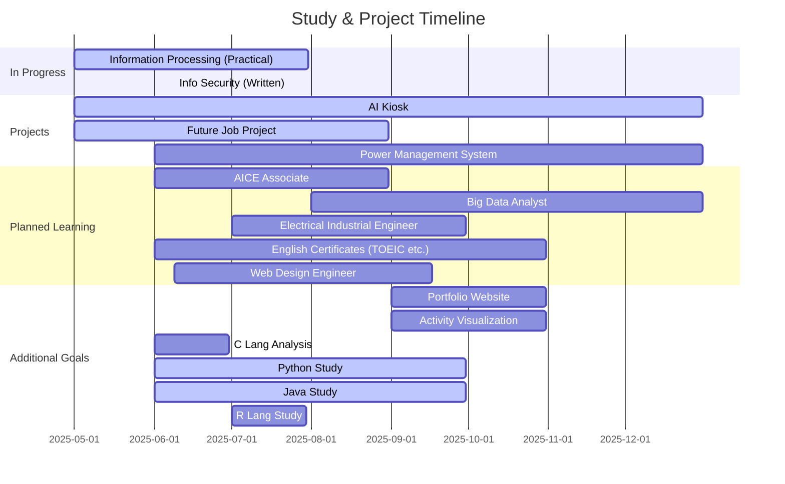

<h1 align="left">
        <a href="https://github.com/skwjdgh/skwjdgh/blob/main/README.md">
    
  </a>
</h1>


<p align='center'>
  
</p>


---

## 💡 Interests

* AI/ML: Data analysis, machine learning model development
* Databases: SQL-based analysis, modeling, performance tuning

---

## 🧑‍💼 Education & Experience

### Education

* **Soongsil University** – B.S. in Information & Electronic Engineering (2009.03 – 2018.02)

### Language Study

* **Greenriver Community College (IESL)** (2007.12 – 2008.07)
* **Highline Community College (ESL)** (2008.08 – 2009.02)

### Work Experience

* **Sungwoo Industry Co., Ltd.** – Accounting & Finance Support
* **Harim Co., Ltd.** – FS Sales & Online Distribution
* **Jungsoo Energy** – Renewable Energy (Solar) Support

---

## 💻 Skills & Projects

### Ongoing Projects

1. **AI Kiosk for Public Use (Hanium Contest)** – 2025
2. **Future Job Project** – 2025
3. **AI-Based Power Management System** – 2025

### Tech Stack

#### Programming Languages

*              

#### Development Tools & Environment

* OS:   
* IDEs:       
* DevOps:     
* Virtualization: 
* Cloud:     


---

## 📘 Certifications & Learning

### Certifications (Completed)

* Network Administrator Level 2
* Korean History Level 1
* KBS Korean Language Level 3+

### In Progress

* Information Processing Engineer (Practical)
* SQLD
* ADSP
* Information Security Engineer (Written: 2025-06-09)

### Planned

* AICE Associate
* Web Design Functional Engineer
* Big Data Analyst
* Electrical Industrial Engineer
* TOEIC/TOEIC Speaking (Retake)

---

## 📈 Repository Structure

```
skwjdgh/
├── portfolio/
│   ├── web/
│   └── visualization/
├── projects/
│   ├── ai-kiosk/
│   ├── future-job/
│   └── power-management/
├── study/
│   ├── Front/
│   │   ├── html-css/
│   ├── Back/
│   │   ├── python/
│   │   ├── java/
│   │   ├── c/
│   │   └── sql/
│   └── External/
│       ├── seminar/
│       └── tools/
└── programmers-ex/
```

* [📂 Portfolio](https://github.com/skwjdgh/Portfolio)
* [🛠 Projects](https://github.com/skwjdgh/Project)
* [🎨 Front-End](https://github.com/skwjdgh/Front)
* [💻 Back-End](https://github.com/skwjdgh/Back)
* [📆 Others](https://github.com/skwjdgh/External)

---

## ✏️ Mid-Term Goals & Schedule



---


<p align="center">
  
  
</p>

<p align='center'>
  
</p>
